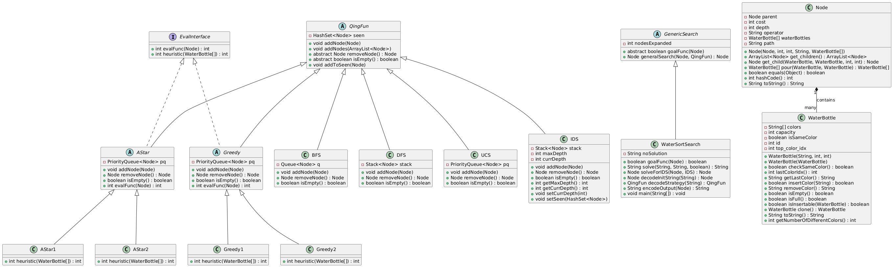

# Water Sort Puzzle Solver

This repository contains an implementation of a Water Sort Puzzle Solver using various search algorithms from the field of Artificial Intelligence (AI). The water sort puzzle is a classic sorting challenge where the goal is to arrange colored water in separate tubes, such that each tube contains only one color. This project employs both uninformed and informed search strategies to efficiently find solutions for different puzzle configurations.

## Table of Contents
- [Class Diagram](#class-diagram)
- [Core Components](#core-components)
  - [Node Class](#node-class)
  - [QingFun Class](#qingfun-class)
- [Search Algorithms](#search-algorithms)
  - [Uninformed Search](#uninformed-search)
    - [Breadth-First Search (BFS)](#breadth-first-search-bfs)
    - [Depth-First Search (DFS)](#depth-first-search-dfs)
    - [Iterative Deepening Search (IDS)](#iterative-deepening-search-ids)
    - [Uniform Cost Search (UCS)](#uniform-cost-search-ucs)
  - [Informed Search](#informed-search)
    - [A* Search](#a-search)
    - [Greedy Search](#greedy-search)

## Class Diagram
Below is a class diagram representing the structure of our solution and the relationships between core components.

## Core Components

### Node Class
The `Node` class represents a single state in the Water Sort Puzzle. Each node holds information on:
- **Parent Node**: Links to the previous state, helping trace the solution path.
- **Cost**: Represents the accumulated cost of moves taken to reach this state.
- **Depth**: Indicates how deep the node is in the search tree.
- **Operator**: Records the move taken to reach this state.
- **WaterBottle States**: Each bottle’s color configuration is stored, representing the current state of the puzzle.
- **Path**: A record of moves from the starting point to the current node.

### QingFun Class
`QingFun` is an abstract class that manages state exploration during the search. It provides essential methods for handling nodes:
- **Seen States**: Uses a set to track visited states, ensuring the algorithm avoids revisiting duplicate states.
  - For example, **Breadth-First Search (BFS)** uses a queue, adding nodes to the end and removing them from the front.  
   
   &nbsp;  
   
   - **Depth-First Search (DFS)** uses a stack structure, where nodes are both added and removed from the top.  
   
   &nbsp;  
   
   - Other search methods (e.g., Uniform Cost Search, A*) implement these operations according to their own needs.
   &nbsp;

- **Add to Seen**: Provides a function to mark nodes as visited, preventing revisiting of duplicate states and making the exploration of the puzzle more streamlined.

### WaterSortSearch Class
The `WaterSortSearch` class is the primary controller for solving the Water Sort Puzzle, handling both the initialization of the puzzle state and selecting the appropriate search strategy. It contains methods to decode the puzzle’s initial state, execute the search, and check for solution criteria.

- **decodeInitString**: Converts the initial state from a string into an array of `WaterBottle` objects, creating a starting `Node` for the puzzle. This method extracts information like the number of bottles and their capacities.

- **decodeStrategy**: Maps a string input to a specific search strategy (e.g., "bf" for BFS, "df" for DFS) and returns an instance of the corresponding class.

- **solve**: This is a static method that acts as the main entry point for solving the puzzle. It takes in the initial puzzle state, the search strategy (e.g., BFS, DFS, UCS), and a visualization flag. The `solve` method:
  - Initializes the puzzle's state as a `Node` by decoding the input string.
  - Decodes the strategy to determine which search algorithm to use.
  - If the strategy is **Iterative Deepening Search (IDS)**, it runs a specific function (`solveForIDS`). Otherwise, it uses the general search function (`generalSearch`).
  - Returns either the solution path and cost or "NOSOLUTION" if no solution is found.

- **generalSearch**: Inherited from `GenericSearch`, this function takes in the initial state (a Node) and an instance of the corresponding class of the chosen strategy returned by (`decodeStrategy`) function  performs the core search by iteratively expanding nodes based on the selected strategy (e.g., queue for BFS or stack for DFS). It manages node exploration until it either finds the solution or exhausts all possibilities.

- **goalFunc**: This method checks if a given node meets the goal criteria for the puzzle, where each bottle contains only one color or is empty. It’s called during the search to identify when the puzzle is solved.

- **solveForIDS**: Specifically designed for Iterative Deepening Search (IDS), this method incrementally increases the depth limit, re-running the general search at each depth until it either finds a solution or reaches the maximum depth.

- **encodeOutput**: Once a solution is found, this method formats the output, including the solution path, cost, and the number of nodes expanded.

### GenericSearch Class
The `GenericSearch` class is an abstract class that defines the general search process used by various search strategies. It contains essential methods to support different search techniques:

- **generalSearch**: This is the main search function that operates across all strategies. It starts from an initial node and adds it to the search structure (defined in subclasses of `QingFun`). It then:
  - Removes nodes one by one, checking each for goal conditions using `goalFunc`.
  - Expands the current node if it’s not the goal, generating child nodes and adding them back to the search structure.
  - Tracks the number of nodes expanded as it progresses.
  - Stops when the goal is found or the structure is empty (indicating no solution).

- **goalFunc**: This is an abstract method that must be implemented in subclasses, like `WaterSortSearch`. It defines the criteria for a solution based on the specific puzzle’s requirements.

The `GenericSearch` class provides the base for handling nodes in the search, while specific strategies determine how nodes are added, removed, and processed.

## Search Algorithms

This project implements both **uninformed** and **informed** search algorithms, providing a variety of approaches to solve the puzzle. Each algorithm extends `QingFun` to manage node handling and explores the search space in a unique way.

### Uninformed Search
Uninformed search algorithms explore the state space without any prior knowledge of the solution, expanding nodes systematically.

#### Breadth-First Search (BFS)
BFS explores the puzzle level by level. Starting from the initial state, it adds all possible next moves to a queue. The search examines each node at the current level before moving on to the next, ensuring that the shortest path (in terms of moves) is found first.

#### Depth-First Search (DFS)
DFS explores each possible path to its deepest level before backtracking. This approach uses a stack to keep track of nodes, diving into each possibility until it reaches a dead-end, then backtracking to explore other paths. DFS can be memory-efficient but may not always find the shortest solution.

#### Iterative Deepening Search (IDS)
IDS combines the benefits of BFS and DFS by progressively deepening the search level limit. It performs DFS with a depth limit, incrementally increasing the depth limit until a solution is found. This method finds the shortest path without the high memory usage of BFS.

#### Uniform Cost Search (UCS)
UCS expands nodes based on the accumulated cost rather than depth, using a priority queue to explore the lowest-cost path first. This ensures an optimal solution, as UCS always takes the cheapest route to reach the solution.

### Informed Search
Informed search algorithms use heuristics to guide the search, making them generally faster and more efficient than uninformed methods.

#### A* Search Heuristics
A* search combines the actual cost to reach a node with a heuristic estimate of the remaining cost to the goal, aiming to find the shortest path. The two heuristics implemented in A* (AStar1 and AStar2) address different aspects of bottle sorting:

- **AStar1 Heuristic**: `Max Diversity in Bottles`
  - This heuristic calculates the number of different colors in the bottle with the most color diversity. For example, if a bottle has three colors, it indicates a greater level of disorganization and complexity.
  - By prioritizing moves that reduce the color variety in the most complex bottle, the heuristic assumes that fewer mixed colors mean the solution is closer, as each bottle approaches a single color state.
  - **Why it works**: This heuristic focuses on minimizing the most "problematic" bottle in the current state, where high color diversity suggests more moves are necessary to isolate a single color. Reducing this complexity should simplify the rest of the puzzle.

- **AStar2 Heuristic**: `Count of Unsorted Bottles`
  - This heuristic counts the number of bottles that are not yet filled with a single color (i.e., those that still have a mix of colors).
  - By aiming to reduce the count of mixed bottles, it seeks to bring the puzzle closer to the goal where every bottle is either empty or filled with a uniform color.
  - **Why it works**: In this puzzle, each unsorted bottle represents unfinished work. By minimizing unsorted bottles, the heuristic encourages moves that achieve completion, which, in turn, means progress toward solving the puzzle.

#### Greedy Search Heuristics
Greedy search uses only the heuristic value to decide which node to explore next. While this makes it faster, it does not guarantee the shortest solution path since it might skip promising paths. The two heuristic variants in Greedy search (Greedy1 and Greedy2) mirror the A* heuristics but focus solely on making each move closer to the immediate goal:

- **Greedy1 Heuristic**: `Max Diversity in Bottles`
  - Similar to AStar1, this heuristic targets the bottle with the highest color diversity and counts the different colors within it. The goal is to reduce this count, assuming that fewer mixed colors mean fewer rearrangement steps are needed.
  - **Why it works**: Greedy1 aims to simplify the most complex bottle immediately, assuming that moves focused on clearing out color diversity in the toughest bottle will lead closer to the goal.

- **Greedy2 Heuristic**: `Count of Unsorted Bottles`
  - Like AStar2, Greedy2 counts bottles that are not yet sorted. By focusing on minimizing this count, it attempts to make the puzzle state more organized with each step, getting closer to a solution with every bottle that reaches a uniform state.
  - **Why it works**: This heuristic encourages moves that result in complete sorting of bottles as fast as possible, assuming that fewer unsorted bottles indicate that a solution is near. However, unlike A*, it may take paths that don’t lead to the shortest overall solution.

**Performance of Search Algorithms** :
The following puzzle was solved using the above algorithms and we compared the CPU utilization and RAM utilization:

Puzzle = "6;6;"
			    + "e,e,e,g,r,r;"   // Bottle 0
			    + "e,e,e,r,b,b;"   // Bottle 1
			    + "e,e,e,b,y,g;"   // Bottle 2
			    + "e,e,e,g,r,y;"   // Bottle 3
			    + "e,e,e,e,e,e;"   // Bottle 4 
			    + "e,e,e,e,e,e;"; // Bottle 5

| Algorithm      | RAM Utilization (MB) | CPU Utilization(%) |
|-----------------|-----------------|------------------|
| Breadth-First Search | 654           | 4.29           |
| Depth-First Search | 12          | 8.89          |
| Uniform Cost Search    | 223           |       4.22     |
| Iterative Deepening Search  | 122           |3.81         |
| Greedy Heuristic 1               | 7           | 0        |
| Greedy Heuristic 2 | 5         | 0            | 
| A Star Heuristic 1               | 150           | 7.37          |
| A Star Heuristic 2 | 19          | 3.57            |
